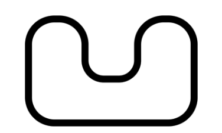
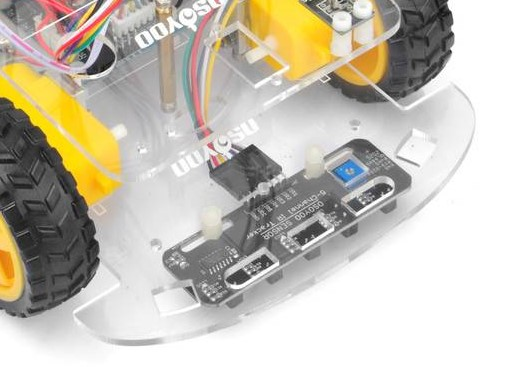
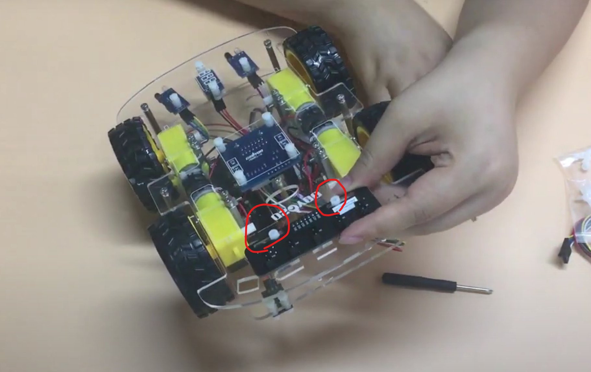
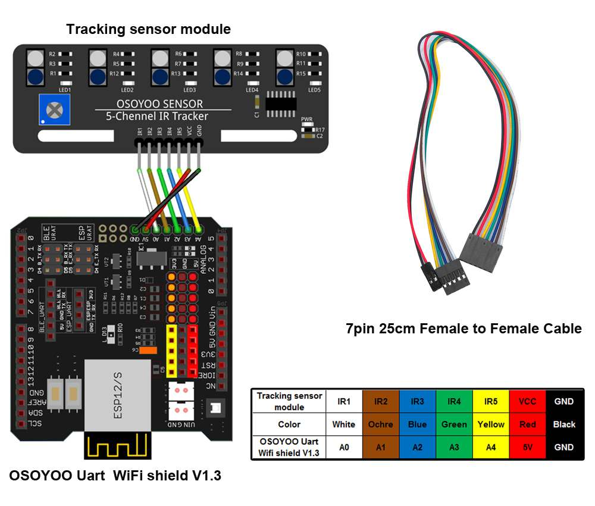

# レッスン16 ライントラッキングをやってみよう

## ミッション

**5個のセンサーで黒い線を読み取り、線に沿ってコースを1周させよう。**

## このレッスンで身につける力

- [ ] トラッキングセンサーを正しく取り付けられる
- [ ] ジャンパーワイヤーを正しく接続できる
- [ ] トラッキングセンサーの感度を調整できる
- [ ] サンプルコードを実行できる
- [ ] 条件式（`&&` `||`）の書き方を理解してコードを修正できる
- [ ] コースを走破するためにサンプルコードを修正できる

## 今回使う技術

- 5チャンネルIRトラッキングセンサーの取り付けと配線
- アナログピン（A0〜A4）での `digitalRead()`
- **5つのセンサーの組み合わせ**による判断
- `&&`（かつ）と `||`（または）
- `set_Motorspeed()` による左右別々の速さ調整

> **センサーの数がふえていきます。**
> 入門07は1個、レッスン15は2個、今回は**5個**。数がふえるほど、こまかい判断ができます。

---

## ミッションの準備

### 用意するもの

- [ ] レッスン11で完成させたロボット
- [ ] 5チャンネルトラッキングセンサーモジュール x1
- [ ] M3プラスチックネジ・ピラー・ナット x2
- [ ] 7ピン 25cm メス-メスケーブル
- [ ] プラスドライバー（感度調整用）
- [ ] USBケーブル x1
- [ ] パソコン x1
- [ ] ライントレース用コース



### 手順

- [ ] 「（日付4桁）(自分の名前・ローマ字)16」で保存する
- [ ] スケッチのフォルダに **`motor_driver.h` をコピー**する

---

## メインミッション

### ステップ1 トラッキングセンサーを取り付けよう


2個のM3プラスチックネジ、プラスチックピラー、およびプラスチックナットを使用して、追跡センサーモジュールを**下部シャーシの下面側**に取り付けます。

近くで見るとこんな感じだよ。



裏側から見るとこんな感じだよ。



> **取り付ける高さが大事です。** 床から近すぎても遠すぎても、線を読めません。
> 1cmくらいを目安にして、あとで調整します。

- [ ] トラッキングセンサーを正しく取り付けられたらチェック

### ステップ2 ジャンパーワイヤーを接続しよう

トラッキングセンサーモジュールのGNDとVCCピンを、OSOYOO UartWiFiシールドのGNDと5Vにそれぞれ接続します。

下の図に示すように、IR1〜IR5ピンを **A0、A1、A2、A3、A4** に、7ピン25cmメス-メスケーブルで接続します。



| センサー | ピン | 位置 |
|---|---|---|
| IR1 | A0 | 左端 |
| IR2 | A1 | 左 |
| IR3 | A2 | 中央 |
| IR4 | A3 | 右 |
| IR5 | A4 | 右端 |

- [ ] ジャンパーワイヤーを正しく接続できたらチェック

### ステップ3 5つのセンサーで何が分かるか考えよう

センサーは、**黒い線の上にあると `0`**、白い床の上だと `1` を返します。

5個ならんでいるので、線がどこにあるかが分かります。

| 左端 | 左 | 中央 | 右 | 右端 | どういう状態？ | どうする？ |
|:--:|:--:|:--:|:--:|:--:|---|---|
| 1 | 1 | **0** | 1 | 1 | 線はまんなか | まっすぐ進む |
| 1 | **0** | 1 | 1 | 1 | 線が少し左 | 少し左に曲がる |
| **0** | 1 | 1 | 1 | 1 | 線がかなり左 | 大きく左に曲がる |
| 1 | 1 | 1 | **0** | 1 | 線が少し右 | 少し右に曲がる |
| 1 | 1 | 1 | 1 | **0** | 線がかなり右 | 大きく右に曲がる |
| 1 | 1 | 1 | 1 | 1 | 線が見えない | コースから外れた |

**この表がそのままプログラムになります。** レッスン15と同じ考え方ですね。

### ステップ4 サンプルコードを実行しよう

以下のコードをコピー＆ペーストして、実行してみよう。

```C++
#include "motor_driver.h"

//**********5チャンネルIRセンサー接続**********//
#define ir1 A0   // 左端
#define ir2 A1   // 左
#define ir3 A2   // 中央
#define ir4 A3   // 右
#define ir5 A4   // 右端

#define SPEED      120   // まっすぐ進むときの速さ
#define TURN_SPEED 150   // 曲がるときの速さ

void setup() {
  init_GPIO();

  pinMode(ir1, INPUT);
  pinMode(ir2, INPUT);
  pinMode(ir3, INPUT);
  pinMode(ir4, INPUT);
  pinMode(ir5, INPUT);

  Serial.begin(9600);
  beep(1, 200);          // 準備できたよの合図
}

void loop() {
  //センサー値の読み取り（黒い線の上なら 0）
  int s1 = digitalRead(ir1);  //左端のセンサ
  int s2 = digitalRead(ir2);  //左センサー
  int s3 = digitalRead(ir3);  //中央センサ
  int s4 = digitalRead(ir4);  //右センサー
  int s5 = digitalRead(ir5);  //右端のセンサ

  // シリアルモニターで見えるように表示（黒が1に見えるよう反転）
  Serial.print(!s1);
  Serial.print(!s2);
  Serial.print(!s3);
  Serial.print(!s4);
  Serial.println(!s5);

  if (s3 == 0) {
    // 中央が線の上 → まっすぐ進む
    go_Advance(SPEED, 0);
  }
  else if (s2 == 0) {
    // 少し左にずれた → 進みながら、左をおそくしてゆるく左へ
    go_Advance(SPEED, 0);
    set_Motorspeed(80, TURN_SPEED);
  }
  else if (s1 == 0) {
    // かなり左にずれた → 大きく左へ
    go_Left(TURN_SPEED, 0);
  }
  else if (s4 == 0) {
    // 少し右にずれた → 進みながら、右をおそくしてゆるく右へ
    go_Advance(SPEED, 0);
    set_Motorspeed(TURN_SPEED, 80);
  }
  else if (s5 == 0) {
    // かなり右にずれた → 大きく右へ
    go_Right(TURN_SPEED, 0);
  }
  else {
    // どのセンサーも線を見ていない → コースから外れた
    stop_Stop();
    beep(3, 80);       // 「外れたよ」の合図
  }
}
```

> **`set_Motorspeed(左, 右)` を使うと、なめらかに曲がれます。**
> `go_Left()` はその場で回ってしまいますが、`set_Motorspeed(80, 150)` は
> 左をおそく・右を速くするので、**進みながらゆるく左に曲がります。**
>
> **`set_Motorspeed()` は速さを変えるだけで、進む向きは変えません。**
> だから先に `go_Advance()` で「前向き」を決めてから、速さを変えています。
> これを忘れると、止まったまま動かないことがあります。

- [ ] サンプルコードを実行できたらチェック

---

## 確認

### センサーが線を読めているか確かめよう

**走らせる前に、必ずここを確かめます。**

ロボットの電源を切って、USBだけつないだ状態でシリアルモニターを開こう。
手でロボットを持って、コースの上をゆっくり動かしてみます。

- [ ] 線の上にセンサーがあると、その位置の数字が `1` になる
- [ ] 白いところでは `0` になる
- [ ] ロボットを左右に動かすと、`1` の位置が**動きに合わせて**左右にうつる
- [ ] 5つとも反応する（反応しないセンサーがない）

**表示の例**

```
00100   ← 中央だけ線の上（まっすぐ進むべき）
01000   ← 少し左にずれている
00010   ← 少し右にずれている
00000   ← 線が見えていない
```

### 感度と高さを調整しよう

- [ ] センサーの**高さ**を調整した（床から1cmくらい）
- [ ] ドライバーで**感度**を調整した
- [ ] 5つとも同じくらいの反応になった

> **高さがそろっていないと、一部のセンサーだけ反応しません。** 横から見て水平か確かめよう。

### 動かして確かめよう

- [ ] 直線を線に沿って走れる
- [ ] ゆるいカーブを曲がれる
- [ ] きついカーブを曲がれる
- [ ] コースを1周できた
- [ ] **3回やって3回とも1周できた**

うまくいかないときは、ここを見てみよう。

| 症状 | 見るところ |
|---|---|
| センサーが反応しない | 高さ（近すぎ・遠すぎ）、感度のネジ、配線 |
| まっすぐ進まずすぐ外れる | `SPEED` を下げる。速いと反応が間に合わない |
| カーブで外れる | `TURN_SPEED` を上げる／曲がる判断を早くする |
| 左右に大きくゆれる | 曲がる速さが強すぎる。`set_Motorspeed` の差を小さくする |
| 外れたまま止まらない | `else` のところが動いているか（「ピピピ」が鳴るか） |
| 逆に曲がる | ir1〜ir5 の配線が左右逆になっていないか |

> **「ピピピ」が鳴ったらコースアウト。** 音を聞けば、目を離していても分かります。

---

## やってみよう

### 1. 速さを上げてタイムを縮めよう

1周できるようになったら、**速さを上げて**タイムを縮めよう。

| 回 | SPEED | TURN_SPEED | タイム | 結果 |
|---|---|---|---|---|
| 1 | 120 | 150 | 秒 | 完走 / 外れた |
| 2 | 150 | 180 | 秒 | |
| 3 | 180 | 200 | 秒 | |

速くするとカーブで外れやすくなります。**どこまで上げられるか**が腕の見せどころです。

- [ ] 自己ベストのタイムを記録できたらチェック

### 2. 条件式を組み合わせてみよう

いまは1つずつセンサーを見ています。**`&&` や `||` を使うと、もっとこまかく判断できます。**

```C++
  // 中央と左の両方が線の上 → ちょっとだけ左にずれている
  if (s3 == 0 && s2 == 0) {
    set_Motorspeed(100, 130);
  }
```

| 記号 | 意味 | 例 |
|---|---|---|
| `&&` | かつ（両方） | `s2 == 0 && s3 == 0` … 左と中央の両方が線の上 |
| `\|\|` | または（どちらか） | `s1 == 0 \|\| s2 == 0` … 左端か左のどちらかが線の上 |

- [ ] `&&` を使った条件を1つ追加できたらチェック
- [ ] `||` を使った条件を1つ追加できたらチェック

### 3. コースアウトしたら線をさがそう（発展）

いまはコースから外れると止まってしまいます。
**外れたら、その場で回って線をさがす**ようにしてみよう。

```C++
  else {
    // 線が見えない → その場で回ってさがす
    beep(1, 50);
    go_Right(120, 0);
  }
```

さらに工夫すると、**最後に線が見えた方向にさがす**ようにもできます。
「さっきどっちにずれたか」を変数に覚えておけばいいですね。

- [ ] 線をさがして復帰できたらチェック

### 4. 十字路を作ってみよう（発展）

コースに十字路があったら、5つのセンサーは `11111`（全部線の上）になります。
このとき**まっすぐ進む**ようにするには、どんな条件を書けばいいかな？

---

## まとめ

- トラッキングセンサーは、**黒い線の上で `0`**、白い床で `1`
- センサーが**5個**あると、線がどこにあるかがこまかく分かる
- センサーの組み合わせの表が、そのままプログラムになる
- **`&&`** はかつ、**`||`** はまたは
- `set_Motorspeed(左, 右)` を使うと、**進みながらなめらかに曲がれる**
- **高さと感度の調整**が大事。プログラムだけでは走らない
- 走らせる前に、**シリアルモニターでセンサーの値を確かめる**
- 速くするほど外れやすくなる。速さと正確さはトレードオフ

### できるようになったことをチェックしよう

- [ ] トラッキングセンサーを正しく取り付けられる
- [ ] ジャンパーワイヤーを正しく接続できる
- [ ] トラッキングセンサーの感度を調整できる
- [ ] サンプルコードを実行できる
- [ ] 条件式（`&&` `||`）の書き方を理解してコードを修正できる
- [ ] コースを走破するためにサンプルコードを修正できる

### まとめページに書こう

Googleサイトの自分の**まとめページ**に、次の4つを書こう。

1. **やったこと**
2. **わかったこと**
3. **感じたこと**
4. **つぎやること**

**スクリーンショットか画像を必ず1枚入れること。** 今日はライントレースしている動画か、センサーの値が出ているシリアルモニターを入れよう。

> まとめは1日に1回書く。
> 複数のレッスンを進めた日も、1つのレッスンが1回で終わらなかった日も、まとめは1回。
