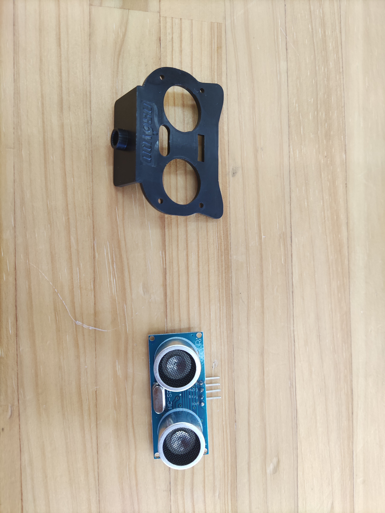
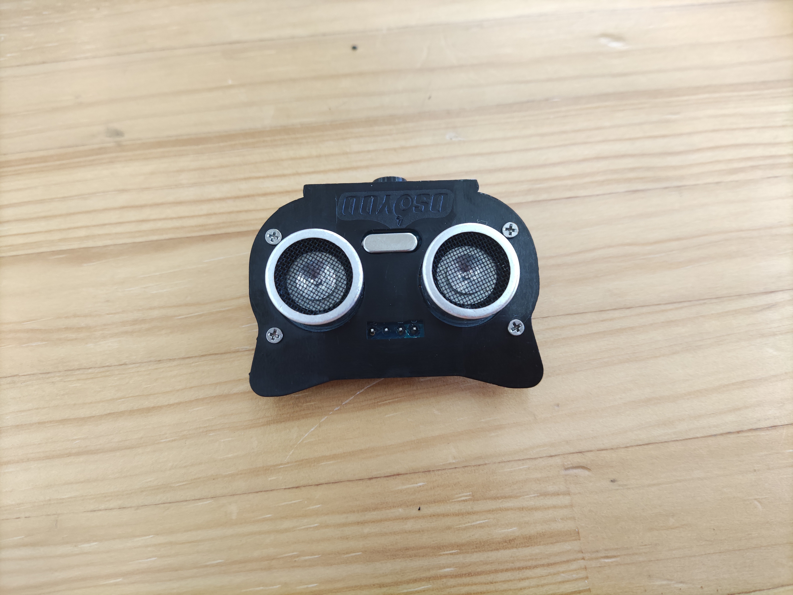
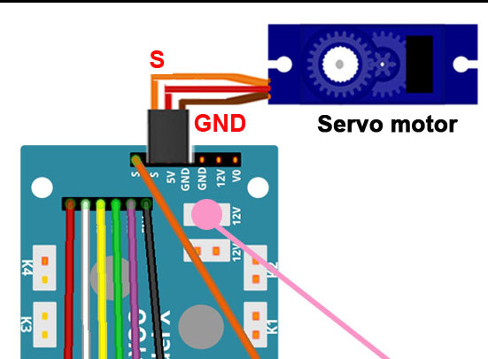
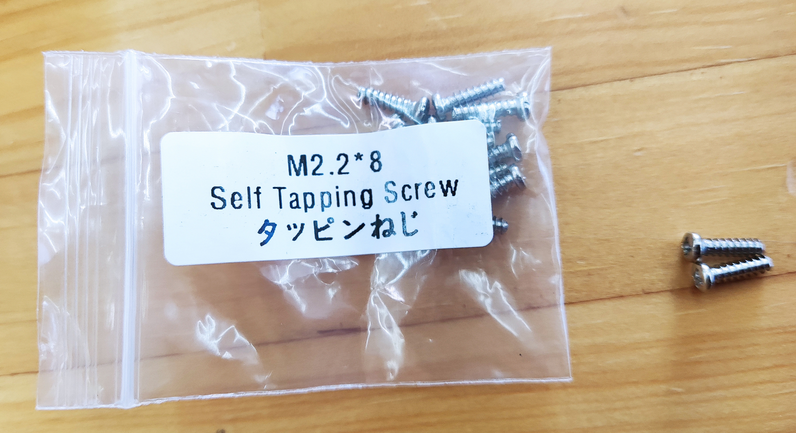
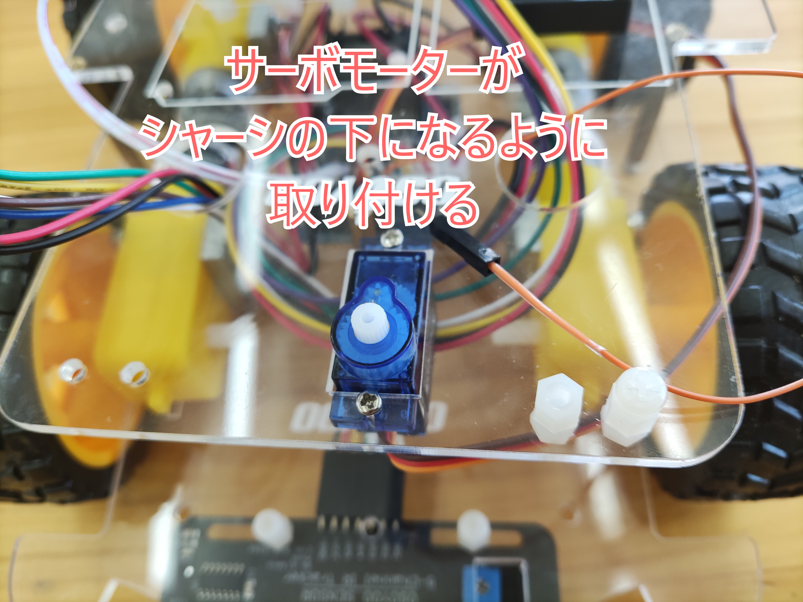
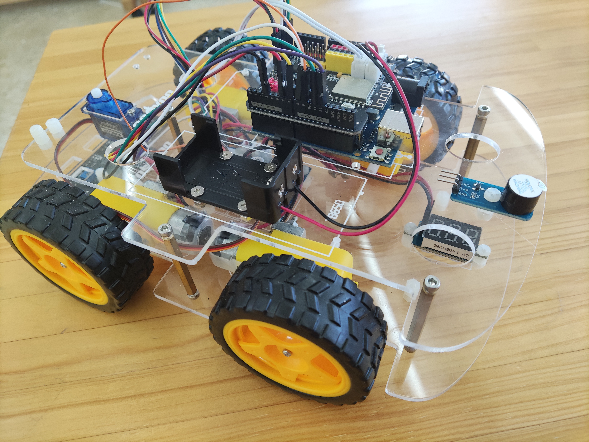
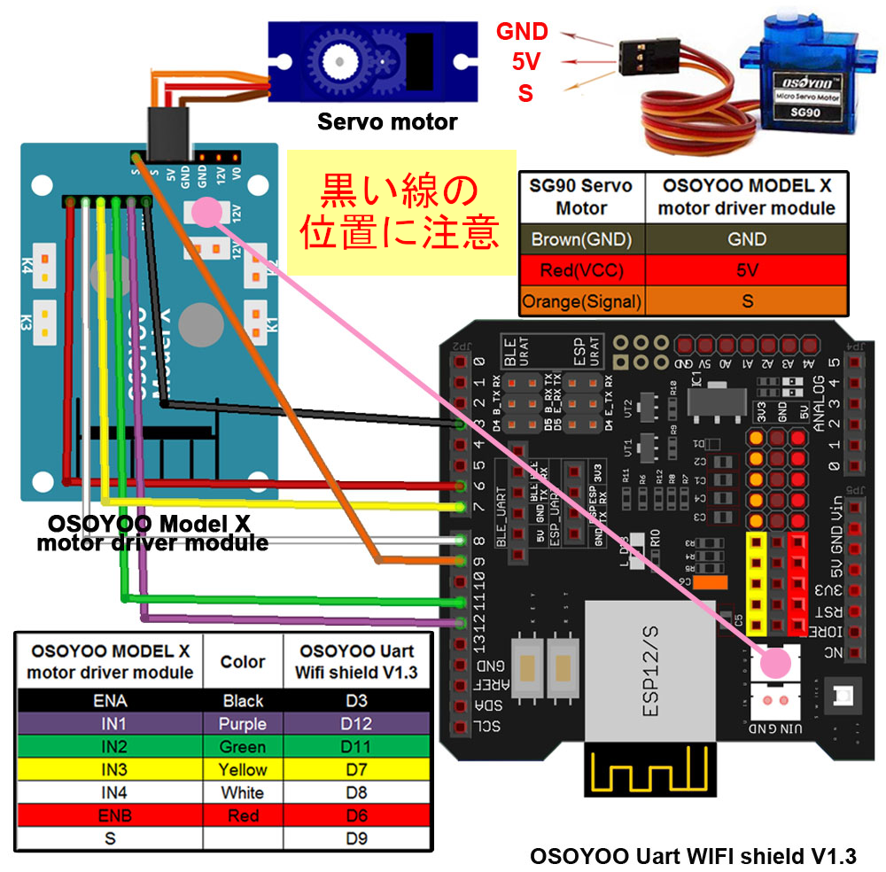
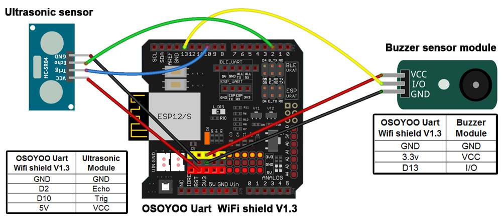
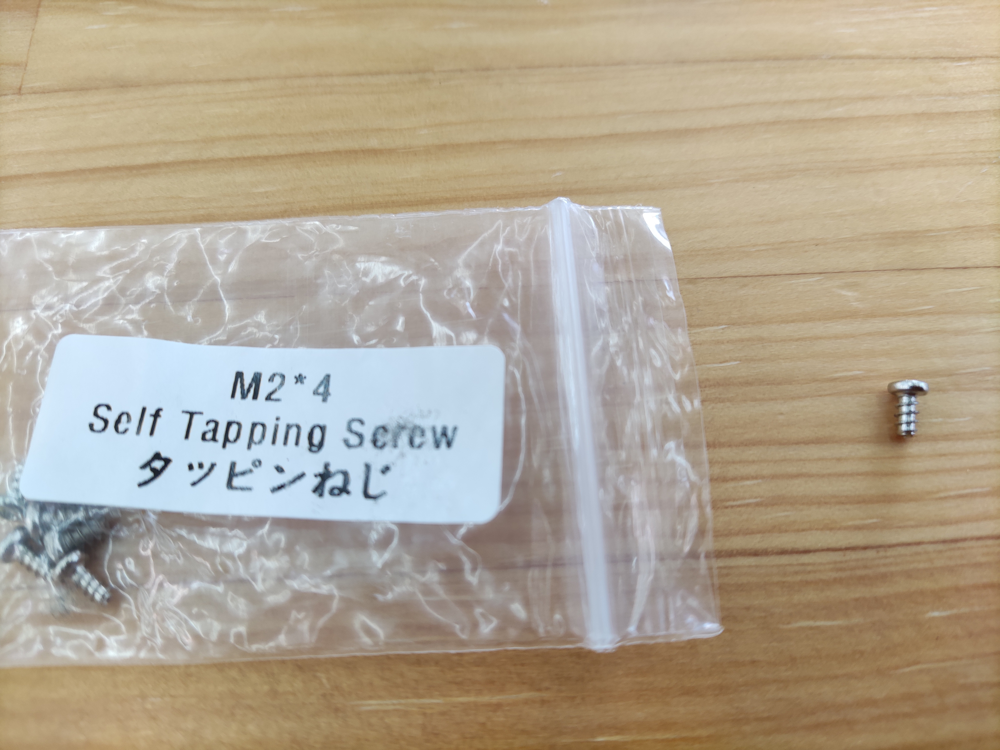
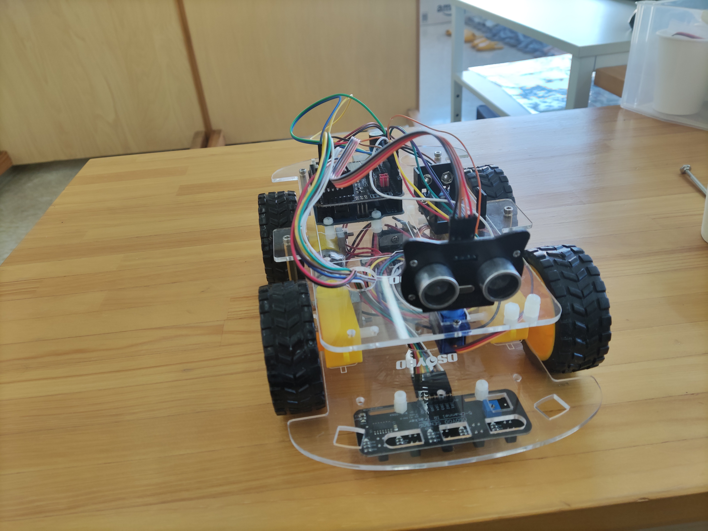

# レッスン17 迷路チャレンジ2

## ミッション

**超音波センサーとサーボで周りを見わたし、自分で判断して迷路を抜けるロボットを作ろう。**

## このレッスンで身につける力

- [ ] 超音波センサを正しく取り付けることができる
- [ ] ジャンパーワイヤーを正しく接続できる
- [ ] 超音波センサーの位置を調整できる
- [ ] サンプルコードを実行できる
- [ ] コースを走破するためにサンプルコードを修正できる
- [ ] **自分で判断のしかたを選んで**プログラムできる

## 今回使う技術

- 超音波センサーとサーボモーターのロボットへの取り付け
- （復習）`pulseIn()` と距離の計算 — **入門08**
- （復習）`Servo.h` と `servo.write()` — **入門09**
- 周囲スキャンのアルゴリズム
- パラメータの調整

> **レッスン13の迷路チャレンジ1とのちがい**
> 迷路1は、**人が経路を決めて**プログラムに書きました。コースが変わると書き直しです。
> 今回は、ロボットが**自分で周りを見て判断します。** コースが変わっても走れます。

---

## ミッションの準備

### 用意するもの

- [ ] レッスン11で完成させたロボット
- [ ] 超音波センサー HC-SR04 x1
- [ ] SG90サーボモーター x1
- [ ] 超音波センサー用ホルダー
- [ ] ブザーモジュール x1
- [ ] M1.4*8ネジとナット（小さいので注意）
- [ ] 取り付け用ねじ
- [ ] USBケーブル x1
- [ ] パソコン x1
- [ ] 迷路コース

### 手順

- [ ] 「（日付4桁）(自分の名前・ローマ字)17」で保存する
- [ ] スケッチのフォルダに **`motor_driver.h` をコピー**する

**※以前のレッスンで使ったジャンパーピンは一度すべて取り外します。**

---

## メインミッション

### ステップ1 超音波センサーとホルダーを取り付けよう



M1.4*8ネジとナットを使ってホルダーと超音波センサーを固定します。**ねじとナットが小さいので注意しよう。**



### ステップ2 上シャーシを外してサーボモーターをつなげよう

1. 上シャーシを外します
2. 下シャーシのモータードライバーとサーボモーターのジャンパーワイヤーを取り付けます

   

3. モータードライバーからジャンパー線を一本出しておきます

### ステップ3 サーボモーターを上シャーシに取り付けよう




### ステップ4 ブザーを取り付けよう



### ステップ5 ジャンパーピンを取り付けよう

下の図を見ながらジャンパーピンを取り付ける。




> ### ⚠ ここでD9が使われます
>
> **サーボモーターは D9** につなぎます。
> レッスン11で右モーターのPWMを **D3** にしておいたのは、このためです。
> もしD9のままだったら、ここでモーターかサーボのどちらかが動かなくなっていました。

| 部品 | ピン |
|---|---|
| サーボモーター | D9 |
| 超音波センサー Echo | D2 |
| 超音波センサー Trig | D10 |
| ブザー | D13 |
| 右モーターPWM（ENA） | D3 |

### ステップ6 超音波ホルダーをサーボモータに取り付けよう




**後でホルダーの位置を調整するので、ここでは仮止めでとどめておく。**

### ステップ7 ホルダーの位置を調整しよう

サーボモーターは、どのくらい回転しているかを記憶して、正確に回転位置を出せるモーターです。
なので、**はじめの位置を調整する必要があります。**

> ### ⚠ サーボモーターは壊れやすいので、無理やり手で回すと簡単に壊れます。絶対にやめましょう。

調整用のプログラムを動かします。`sample/` フォルダの **`Lesson_17_sample.ino`** を開いて書き込もう。

プログラムを実行すると、**ピピピという音の後に3秒サーボモーターが静止します。**
ここで電源を切って、ホルダーのねじを取り外して、**この位置で超音波センサーが正面を向くように**調整しましょう。

調整が成功するとこんな感じになります。

https://www.youtube.com/embed/hYld9d5zTak?si=kk0jfPL_co6i4WDr

> #### ◇■ 左側のモーターが動かないとき！ ■◇
> モーターのジャンパー線を確認しましょう。**10番ピンに黒い線が入っているとうまく動きません。**

- [ ] 超音波センサーの位置を調整できたらチェック

### ステップ8 サンプルコードは「正解」ではなく「たたき台」です

サンプルコードは、**とりあえず動く1つの例**にすぎません。
このコードのままでは、たぶんコースをクリアできません。**自分で直していくのが今回の課題です。**

まず、サンプルがどう判断しているかを読み取ろう。

```
1. 前方の距離を測る
2. 近ければ、止まって周りを見わたす（サーボで首をふる）
3. 左・右・ななめの距離を測る
4. 一番広く空いている方向を選ぶ
5. その方向に曲がって進む
```

### ステップ9 調整できる数字を見つけよう

コードの上のほうに、調整できる数字がならんでいます。

| 名前 | 意味 | 大きくすると |
|---|---|---|
| `distancelimit` | 前方の壁を「近い」と判断する距離 | 早めに止まる |
| `sidedistancelimit` | 横の壁を「近い」と判断する距離 | 壁から遠めを通る |
| `SPEED` | ふつうの速さ | 速くなる（曲がりにくくなる） |
| `TURN_SPEED` | 曲がるときの速さ | きびきび曲がる |
| `turntime` | 曲がる時間 | 大きく曲がる |
| `backtime` | 下がる時間 | 大きく下がる |

**まず1つだけ変えて、何が変わるか確かめよう。** 一度に何個も変えると、何が効いたか分かりません。

- [ ] サンプルコードを実行できたらチェック

---

## 確認

### センサーが距離を測れているか確かめよう

**走らせる前に確かめます。** シリアルモニターを開いて、手を近づけたり遠ざけたりしよう。

- [ ] 前方の距離が表示される
- [ ] 手を近づけると数字が小さくなる
- [ ] 壁から10cmのところに置くと、10前後と出る（定規で確かめる）
- [ ] サーボが首をふるとき、左右それぞれの距離が表示される

### サーボの動きを確かめよう

- [ ] サーボが正面（90度）を向いている
- [ ] 左を見たとき、ちゃんと左の壁の距離が出る
- [ ] 右を見たとき、ちゃんと右の壁の距離が出る
- [ ] 首をふり終わると、正面にもどる

> **左右が逆になっていないか**、必ず確かめよう。
> 逆だと、ロボットは「空いているほう」と反対に曲がってしまいます。

### 動かして確かめよう

- [ ] 壁の手前で止まる
- [ ] 止まったあと、首をふって周りを見る
- [ ] 空いているほうに曲がる
- [ ] 壁にぶつからずに進み続ける

うまくいかないときは、ここを見てみよう。

| 症状 | 見るところ |
|---|---|
| 壁にぶつかる | `distancelimit` を大きくする（早めに止まる） |
| 遠くで止まりすぎる | `distancelimit` を小さくする |
| 曲がりが足りない | `turntime` を大きくする |
| 曲がりすぎる | `turntime` を小さくする |
| 同じところをぐるぐる回る | 判断のしかたを見直す（下の「やってみよう」へ） |
| 距離がめちゃくちゃ | センサーがななめを向いていないか。ホルダーの調整 |
| サーボが動かない | D9につながっているか。モーターのPWMがD3になっているか |
| 左のモーターが動かない | 10番ピンに黒い線が入っていないか |

---

## やってみよう

### 1. パラメータを1つずつ調整しよう

**記録しながら**調整しよう。変えた数字と結果を残すと、もとに戻せます。

| 回 | 変えたもの | 前の値 | 新しい値 | 結果 |
|---|---|---|---|---|
| 1 | | | | |
| 2 | | | | |
| 3 | | | | |

- [ ] 1つずつ変えて結果を記録できたらチェック
- [ ] 迷路をクリアできたらチェック

### 2. 判断のしかたを自分で選ぼう

**ここが今回の本番です。** 迷路を抜ける方法は1つではありません。

| やり方 | 考え方 | 得意なコース |
|---|---|---|
| **一番広いほうへ** | 首をふって一番遠い方向を選ぶ | 広い迷路 |
| **右手法** | いつも右の壁にそって進む | どんな迷路でも必ず出口に着く |
| **止まらず走る** | 走りながら測って、ぶつかりそうなら曲がる | 速さ重視 |

**どれを選ぶかは自分で決めよう。** 選んだ理由も考えてみてね。

> **右手法のヒント**
> 「右が空いていれば右へ。空いていなければまっすぐ。前もふさがっていれば左へ」
> この3つのルールだけで、どんな迷路でも出口にたどり着けます。

```C++
  if (右の距離 > sidedistancelimit) {
    go_Right(TURN_SPEED, turntime);   // 右が空いていれば右へ
  }
  else if (前の距離 > distancelimit) {
    go_Advance(SPEED, 0);             // 前が空いていればまっすぐ
  }
  else {
    go_Left(TURN_SPEED, turntime);    // どちらもだめなら左へ
  }
```

- [ ] 自分でやり方を選べたらチェック
- [ ] 選んだ理由を説明できたらチェック
- [ ] 選んだやり方でクリアできたらチェック

### 3. 判断を音で知らせよう

ロボットが**いま何を考えているか**を音で分かるようにしよう。

| 場面 | 音 |
|---|---|
| まっすぐ進む | 鳴らさない |
| 右に曲がる | ピッ（1回） |
| 左に曲がる | ピピッ（2回） |
| 行き止まりで下がる | ピピピッ（3回） |

```C++
  beep(2, 80);      // 左に曲がるよ
  go_Left(TURN_SPEED, turntime);
```

**見ているだけでは、ロボットが「まちがえた」のか「そう判断した」のか分かりません。**
音があれば、判断がまちがっているのか、動きがずれているのかを切り分けられます。

- [ ] 判断を音で知らせられたらチェック

### 4. 速さと正確さ、どちらを取る？

速くすると、センサーが測るより先に壁にぶつかります。
おそくすると、確実ですがタイムがかかります。

| 設定 | タイム | 成功率（5回中） |
|---|---|---|
| おそい（SPEED 100） | 秒 | 回 |
| ふつう（SPEED 150） | 秒 | 回 |
| 速い（SPEED 200） | 秒 | 回 |

**自分はどちらを優先するか**決めて、その設定で挑戦しよう。

- [ ] 表をうめられたらチェック
- [ ] 自分の優先を決めて説明できたらチェック

---

## まとめ

- 超音波センサー＋サーボで、**ロボットが自分で周りを見わたせる**ようになる
- 迷路1は**人が経路を決めた**。迷路2は**ロボットが判断する**
- だから、**コースが変わっても走れる**
- サーボは **D9**。だからモーターのPWMを **D3** にしてあった
- サンプルコードは「正解」ではなく**たたき台**。自分で直すもの
- パラメータは**1つずつ**変えて、記録しながら調整する
- 迷路の解き方は1つではない（一番広いほうへ／右手法／止まらず走る）
- **速さと正確さはトレードオフ。** どちらを取るかは自分で決める
- 音を使うと、**判断のまちがいか動きのずれか**を切り分けられる

### できるようになったことをチェックしよう

- [ ] 超音波センサを正しく取り付けることができる
- [ ] ジャンパーワイヤーを正しく接続できる
- [ ] 超音波センサーの位置を調整できる
- [ ] サンプルコードを実行できる
- [ ] コースを走破するためにサンプルコードを修正できる
- [ ] **自分で判断のしかたを選んで**プログラムできる

### まとめページに書こう

Googleサイトの自分の**まとめページ**に、次の4つを書こう。

1. **やったこと**
2. **わかったこと**
3. **感じたこと**
4. **つぎやること**

**スクリーンショットか画像を必ず1枚入れること。** 今日は迷路を自分で進んでいる動画を入れよう。

> まとめは1日に1回書く。
> 複数のレッスンを進めた日も、1つのレッスンが1回で終わらなかった日も、まとめは1回。
