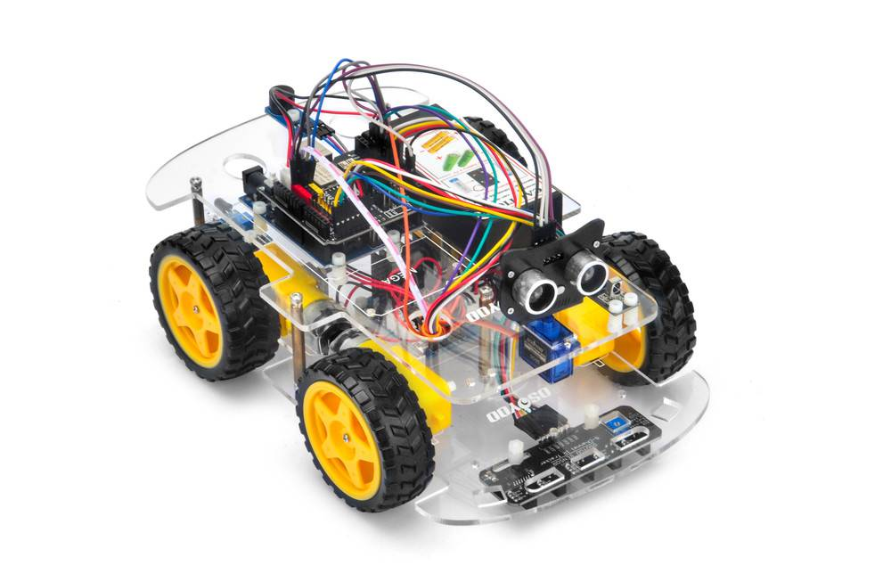
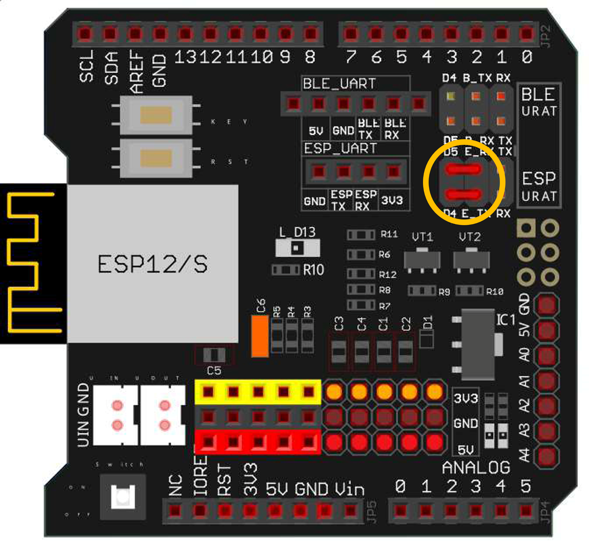
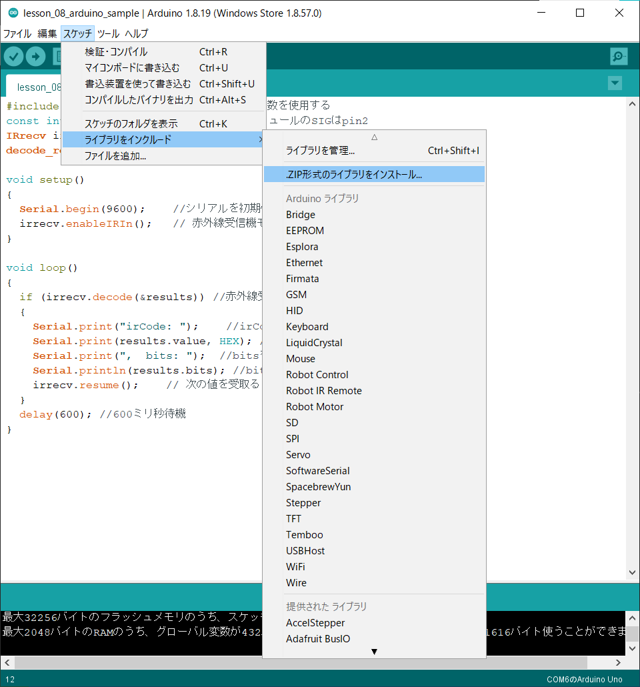
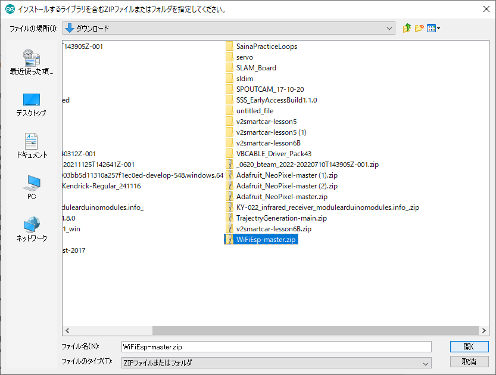
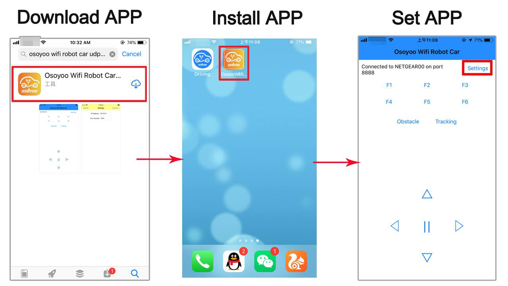

# レッスン18 Wifi接続でロボットを動かそう

## ミッション

**WiFiでロボットとタブレットをつなぎ、アプリで操縦してコースを走破しよう。**

## このレッスンで身につける力

- [ ] WiFiライブラリを追加できる
- [ ] ジャンパーピンを正しく接続できる
- [ ] **接続できたことを確かめられる**
- [ ] STAモードでSSIDとパスワードを使ってWiFiに接続できる
- [ ] APモードで直接タブレットと接続できる
- [ ] コースを走破するためにサンプルコードを修正できる

## 今回使う技術

- ジャンパーキャップの取り付け
- `WiFiEsp` ライブラリ（UDP通信）
- SSID・パスワード・IPアドレス
- STAモードとAPモード

> ### ⚠ このレッスンは「つながらない」でつまずきやすい
>
> だから、**先に「つながったか」だけを確かめる工程**を入れてあります。
> つながっていないのに走らせようとしても、絶対に動きません。
> **ステップ5で「つながった」ことを確かめてから、ステップ6に進もう。**

---

## ミッションの準備

### 用意するもの

- [ ] レッスン11で完成させたロボット（WiFiシールド付き）
- [ ] 赤色のジャンパーキャップ
- [ ] タブレットまたはスマートフォン
- [ ] USBケーブル x1
- [ ] パソコン x1
- [ ] コース
- [ ] 教室のWiFiのSSIDとパスワード（先生に聞く）

### 手順

- [ ] 「（日付4桁）(自分の名前・ローマ字)18」で保存する

---

## メインミッション

### ステップ1 WiFiってなに？

みんなはお家でスマートフォンやタブレットを使って動画を見たり、ゲームをしたりすることはあるかな？
その時にインターネットに接続するために必要なのが **WiFi** だよ。

WiFiは**無線通信**と言って、人間には見ることのできない電波を用いてデータのやり取りを行なっているんだよ。

> **入門05でやった赤外線を思い出そう。**
> 赤外線も目に見えない光で情報を送っていました。WiFiは電波を使います。
> どちらも「目に見えないもので情報を送る」という点では同じです。
>
> ちがいは**とどく距離**と**送れる量**。赤外線はまっすぐ数メートル、WiFiは壁ごしに数十メートルとどきます。

### ステップ2 接続準備をしよう

前のレッスンで使ったロボットを少しだけ改良するよ。



改良する場所はここ！ Arduinoの上についている黒い基板があることを確認しよう。
**赤色のジャンパーキャップ**をイラストの円で囲った部分と同じように接続しよう。ジャンパーキャップは赤色の小さな部品のことだよ。



- [ ] ジャンパーピンを正しく接続できたらチェック

### ステップ3 WiFiEspライブラリをインストールしよう

**入門05**でライブラリをインストールしたことを覚えているかな？
ライブラリは、難しいプログラムを組まなくても、これを使うことで効率的により簡単に開発ができる優れたものだったね。

今回使うWiFiの技術も、実際に自分でプログラムを組もうとするとより高度で難しい内容になるので、WiFiEspライブラリをインストールしてから使います。

[WiFiEsp Library](https://osoyoo.com/driver/WiFiEsp-master.zip) ← クリックしてダウンロード

ダウンロードが終わったらArduino IDEを開いて、
スケッチ→ライブラリをインクルード→**ZIP形式のライブラリをインストール**を押そう。



さっきダウンロードしたzipファイルを探して、開くボタンを押すとインストールできるよ。



- [ ] WiFiライブラリを追加できたらチェック

### ステップ4 操作アプリをタブレットにインストールしよう

今回は **OSOYOO WIFI UDP Robot Car control APP** を使ってロボットを動かすよ。
タブレットのアプリストアからインストールしよう。



### ステップ5 🔴 まず「つながったか」だけを確かめよう

**ここがこのレッスンで一番大事なところです。走らせるのはまだです。**

`sample/lesson_18_sample/lesson_18_sample.ino` を開いて、SSIDとパスワードを書きかえます。

```C++
char ssid[] = "YOUR_ROUTER_SSID";           // ←教室のWiFiの名前
char pass[] = "YOUR_ROUTER_WIFI_PASSWORD";  // ←そのパスワード
```

> **STAモードとは**
> ロボットとタブレットが、**WiFiルーターを通して**つながる方式です。
> ルーターがロボットに「IPアドレス」という番号を割りあてて、アプリはその番号でロボットを見つけます。

書き込んだら、**USBをつないだままシリアルモニターを開こう。**

こんな表示が出るはずです。

```
Attempting to connect to WPA SSID: （WiFiの名前）
You're connected to the network
IP Address: 192.168.0.XXX
```

**この `IP Address:` が出たら、接続成功です。**

#### 接続できたときのチェック

- [ ] シリアルモニターに `You're connected to the network` が出た
- [ ] `IP Address:` に数字が表示された
- [ ] その数字を**メモした**（アプリに入力します）

**メモ欄** — IPアドレス： `192.168. ___ . ___`

#### つながらないときは

| 表示 | 意味 | どうする |
|---|---|---|
| 何も出ない | シールドと通信できていない | ジャンパーキャップの位置を確認 |
| `Attempting to connect` のまま止まる | WiFiが見つからない | SSIDのつづりを確認（大文字小文字も） |
| 接続に失敗しつづける | パスワードがちがう | パスワードを確認 |
| `WiFi shield not present` | シールドを認識していない | ジャンパーキャップ、シールドの差し込み |

> **つながるまで次に進まないこと。**
> ここでつまずいたまま走行プログラムに進むと、「動かない原因」が2つ重なって分からなくなります。

- [ ] IPアドレスが表示されたらチェック ⭐

### ステップ6 アプリからロボットを動かそう

接続が確認できたら、いよいよ操縦です。

1. タブレットを**ロボットと同じWiFi**につなぐ
2. アプリを開いて、**ステップ5でメモしたIPアドレス**を入力する
3. アプリのボタンでロボットを動かす

- [ ] アプリからロボットを動かせたらチェック

---

## 確認

### 動かして確かめよう

- [ ] アプリの「前進」でロボットが前に進む
- [ ] 「後進」で下がる
- [ ] 「左」「右」で曲がる
- [ ] 「停止」で止まる
- [ ] ロボットから離れても動かせる

うまくいかないときは、ここを見てみよう。

| 症状 | どこが問題か | 見るところ |
|---|---|---|
| IPアドレスが出ない | **接続**（ステップ5） | ステップ5の表を見る |
| IPは出るがアプリが反応しない | **アプリの設定** | IPアドレスの入力まちがい／タブレットが同じWiFiか |
| アプリは反応するが動かない | **ロボット側** | 電池が入っているか／モーターの配線 |
| 動きがおくれる・止まる | **電波** | ルーターから遠すぎないか |

> **3つのどこでつまずいているかを切り分けよう。**
> ① 接続 → ② アプリ → ③ ロボット。順番に確かめれば、必ず原因が見つかります。

---

## やってみよう

### 1. APモードでつないでみよう

**APモード**は、ロボット自身がWiFiの親機になる方式です。ルーターがなくてもつながります。

| | STAモード | APモード |
|---|---|---|
| つなぎ方 | ルーター経由 | ロボットに直接 |
| ルーター | 必要 | いらない |
| 使う場面 | 教室の中 | 外や、WiFiのない場所 |

タブレットのWiFi設定で、ロボットが出しているネットワーク名を探してつないでみよう。

- [ ] APモードで直接タブレットと接続できたらチェック
- [ ] 2つのモードのちがいを説明できたらチェック

### 2. コースを走破しよう

アプリで操縦してコースを走破しよう！

- [ ] コースを走破できたらチェック
- [ ] タイムを記録できたらチェック（ ___ 秒）

### 3. リモコンとくらべてみよう

**レッスン14の赤外線リモコン**と、今回のWiFiをくらべてみよう。

| | 赤外線リモコン | WiFi |
|---|---|---|
| とどく距離 | | |
| 壁ごしに使えるか | | |
| 反応の速さ | | |
| 使いやすさ | | |

実際に試して、表をうめてみよう。**どちらが優れているかではなく、向き・不向きがあります。**

- [ ] 表をうめられたらチェック
- [ ] どんな場面でどちらを使うといいか、説明できたらチェック

### 4. 自動運転に切り替えよう（発展）

アプリのボタンで、**レッスン16のライントラッキング**や**レッスン17の障害物回避**に切り替えられるようにしてみよう。

「ふだんは手で操縦、ボタンを押したら自動」という、本物のロボットに近い作りになります。

- [ ] 手動と自動を切り替えられたらチェック

### 5. 自分でコースを作ろう

自分でコースを作って、友だちに操縦してもらおう。どんなコースなら難しいかな？

---

## まとめ

- **WiFi**は電波を使った無線通信。赤外線より遠く、壁ごしでもとどく
- `WiFiEsp` ライブラリを使うと、難しい通信プログラムを書かなくてすむ
- **STAモード** … ルーター経由でつなぐ。SSIDとパスワードが必要
- **APモード** … ロボット自身が親機になる。ルーターがいらない
- **IPアドレス**は、ネットワークの中でロボットを見つけるための番号
- **つながったことを先に確かめる。** つながっていないのに走らせても動かない
- つまずいたら **① 接続 → ② アプリ → ③ ロボット** の順に切り分ける

### できるようになったことをチェックしよう

- [ ] WiFiライブラリを追加できる
- [ ] ジャンパーピンを正しく接続できる
- [ ] **接続できたことを確かめられる**
- [ ] STAモードでSSIDとパスワードを使ってWiFiに接続できる
- [ ] APモードで直接タブレットと接続できる
- [ ] コースを走破するためにサンプルコードを修正できる

### まとめページに書こう

Googleサイトの自分の**まとめページ**に、次の4つを書こう。

1. **やったこと**
2. **わかったこと**
3. **感じたこと**
4. **つぎやること**

**スクリーンショットか画像を必ず1枚入れること。** 今日はIPアドレスが表示されたシリアルモニターか、操縦している動画を入れよう。

> まとめは1日に1回書く。
> 複数のレッスンを進めた日も、1つのレッスンが1回で終わらなかった日も、まとめは1回。
