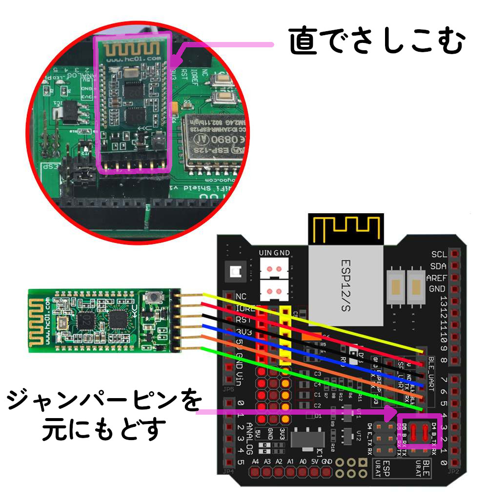

# レッスン19 Bluetooth接続でロボットを動かそう

## ミッション

**Bluetoothでタブレットとロボットをつなぎ、アプリで操縦してコースを走破しよう。**

## このレッスンで身につける力

- [ ] HCモジュールを正しく接続できる
- [ ] **つながったことを確かめられる**
- [ ] タブレットとBluetooth接続ができる
- [ ] サンプルコードを実行できる
- [ ] コースを走破するためにサンプルコードを修正できる

## 今回使う技術

- Bluetoothモジュール（HCモジュール）の配線
- `SoftwareSerial.h` — シリアル通信を別のピンで行う
- 受け取ったデータの読み取り
- `set_Motorspeed()` による細かい速度制御

> ### ⚠ このレッスンも「つながらない」でつまずきます
>
> レッスン18と同じように、**先に「つながったか」だけを確かめる工程**を入れてあります。
> つながっていないのに走らせても、絶対に動きません。

---

## ミッションの準備

### 用意するもの

- [ ] レッスン11で完成させたロボット
- [ ] HCモジュール（Bluetoothモジュール） x1
- [ ] タブレット（教室のiPad）
- [ ] USBケーブル x1
- [ ] パソコン x1
- [ ] ビニールテープ、ベニヤ板（コース作り用）

### 手順

#### 1. 不要なセンサー・モジュールを取り外そう

今回はHCモジュールを使うので、それ以外のセンサやモジュールをはずそう！

- [ ] 不要なセンサー類を取り外せたらチェック

#### 2. 配線をレッスン11の状態に戻そう

このレッスンの配線は**レッスン11（ロボットカーを組み立てよう2）の状態**に戻します。
分からなくなったら、レッスン11のテキストを見て配線を戻しておきましょう。

- [ ] 「（日付4桁）(自分の名前・ローマ字)19」で保存する
- [ ] スケッチのフォルダに **`motor_driver.h` をコピー**する

---

## メインミッション

### ステップ1 Bluetoothってなに？

**Bluetooth**も、WiFiと同じ無線通信のひとつです。でも、使い方がちがいます。

| | WiFi（レッスン18） | Bluetooth（今回） |
|---|---|---|
| つなぐ相手 | ルーター経由でたくさんの機器 | **1対1** |
| とどく距離 | 数十メートル | 数メートル〜10m |
| 使う電力 | 多い | **少ない** |
| 設定 | SSID・パスワード・IPアドレス | **ペアリングするだけ** |
| 使われている例 | スマホのネット接続 | ワイヤレスイヤホン、マウス |

> **Bluetoothのほうが設定は簡単です。** IPアドレスもいりません。
> そのかわり、**近くでしか使えません。**

### ステップ2 HCモジュールをロボットにつなごう

**配線図：**



- [ ] HCモジュールが接続できたらチェック！

### ステップ3 🔴 まず「つながったか」だけを確かめよう

**走らせるのはまだです。** 先に通信ができているかを確かめます。

下の**確認用プログラム**を書き込んで、シリアルモニターを開こう。

```C++
#include <SoftwareSerial.h>

SoftwareSerial BLTSerial(4, 5);   // RX, TX

void setup() {
  Serial.begin(9600);
  BLTSerial.begin(9600);
  Serial.println("--Bluetooth 接続テスト 開始--");
  Serial.println("タブレットでペアリングして、何か送ってみよう");
}

void loop() {
  // タブレットから何か来たら、そのまま表示する
  if (BLTSerial.available()) {
    char c = BLTSerial.read();
    Serial.print("受信: ");
    Serial.println(c);
  }
}
```

> **`SoftwareSerial` とは？**
> Arduinoのシリアル通信ポートは本来1つだけで、それはパソコンとの通信に使っています。
> `SoftwareSerial` を使うと、**ほかのピンでもシリアル通信ができる**ようになります。
> これでパソコンとBluetoothの両方と同時に話せるわけですね。

#### タブレットとペアリングしよう

1. 教室のiPadでアプリを開く

   

2. 「**connect**」をタップ
3. 「**HC-02〜〜**」をタップ

#### 接続できたときのチェック

- [ ] アプリに「HC-02〜〜」が表示された
- [ ] タップしてつながった
- [ ] **アプリのボタンを押すと、シリアルモニターに「受信:」と文字が出る** ⭐

**「受信:」が出たら、通信は成功です。** ここまでできてから次に進もう。

#### つながらないときは

| 症状 | 見るところ |
|---|---|
| アプリに「HC-02」が出てこない | HCモジュールのLEDが光っているか（電源が来ているか） |
| つないでもすぐ切れる | 電池が弱っていないか |
| つながるが「受信:」が出ない | RX・TXの配線が逆になっていないか（**よくあるミス**） |
| 変な文字が出る | 通信速度（9600）が合っているか |

> **RXとTXは、送る側と受け取る側です。** 片方のTXは相手のRXにつなぎます。
> 同じ名前どうしをつなぐと動きません。ここでつまずく人がとても多いところです。

- [ ] 「受信:」が表示されたらチェック ⭐

### ステップ4 ロボットを走らせよう

通信が確認できたら、走行プログラムに進みます。

`sample/` フォルダのサンプルコードを開いて書き込もう。

1. アプリを起動したら「**connect**」をタップ
2. 「**HC-02〜〜**」をタップ
3. 「**Engine**」をタップして起動
4. 「**Speed+**」をタップして走らせよう

- [ ] ロボットが走ったらチェック！

---

## 確認

### 動かして確かめよう

- [ ] 「Engine」でエンジンがかかる
- [ ] 「Speed+」で前に進む
- [ ] タブレットをかたむけると曲がる
- [ ] 止められる

うまくいかないときは、切り分けて考えよう。

| どこまでできている？ | 原因はどこ |
|---|---|
| ペアリングもできない | **配線・電源** |
| ペアリングできるが「受信:」が出ない | **RX/TXの配線** |
| 「受信:」は出るが走らない | **ロボット側**（電池・モーター配線） |
| 走るが思った動きにならない | **プログラム**（次の「やってみよう」へ） |

> レッスン18と同じ考え方です。**どこまでできているかを確かめれば、原因が絞れます。**

---

## やってみよう

### 1. コースを作って走らせよう

ビニールテープを使ってベニヤ板に、下の写真のようなコースを作ってみよう。


- [ ] コースができたらチェック！
- [ ] コースを走破できたらチェック！

### 2. うまく走れるように改造しよう

サンプルコードのままだと、ロボットが思ったように動かなかったかな？
そんなときはコードを改造してみよう！

**わからなくなったときに戻れるように**、「ファイル」→「名前を付けて保存」から `19_2` として保存してから編集しよう。

**ヒント**

| 直すところ | 何が変わる |
|---|---|
| `Speed = ` | まっすぐ進むスピード |
| `TURNSPEED = ` | 回転するスピード |
| `if (cs.angle == 1) ... set_Motorspeed(...)` | タブレットのかたむきで、どれくらいモーターを回すか |

**とくに3つめが大事です。** いまは場合分けが少ないので、動きがカクカクします。
**もっと細かく場合分けすると、なめらかに曲がるようになります。**

```C++
  // 例：かたむきの大きさで曲がり方を変える
  if (cs.angle == 1)      set_Motorspeed(100, 150);   // 少しだけ左
  else if (cs.angle == 2) set_Motorspeed(60, 180);    // もっと左
  else if (cs.angle == 3) set_Motorspeed(0, 200);     // いっぱい左
```

- [ ] プログラムを改造して動きを変えられたらチェック！
- [ ] なめらかに曲がるようになったらチェック！

### 3. 3つの操縦方法をくらべよう

これで3つの操縦方法を体験しました。表をうめてくらべてみよう。

| | 赤外線（14） | WiFi（18） | Bluetooth（19） |
|---|---|---|---|
| とどく距離 | | | |
| 壁ごしに使えるか | | | |
| つなぐまでの手間 | | | |
| 反応の速さ | | | |
| 細かい操作 | | | |

- [ ] 表をうめられたらチェック
- [ ] 自分が一番操縦しやすかったものと、その理由を説明できたらチェック

### 4. 対戦にそなえよう（発展）

次のレッスンからは**ロボット対戦ゲーム**です。
対戦では、**速く正確に操縦できること**が勝敗を分けます。

いまのうちに、自分が一番操縦しやすい設定を見つけておこう。

- [ ] 自分の「勝てる設定」を決めてメモできたらチェック

---

## まとめ

- **Bluetooth**は1対1の無線通信。WiFiより近いが、設定が簡単で電力が少ない
- Bluetoothモジュールを使うためのライブラリは **`SoftwareSerial.h`**
- `SoftwareSerial` を使うと、パソコンとBluetoothの**両方と同時に通信できる**
- **RXとTXは、送る側と受け取る側。** 同じ名前どうしをつなぐと動かない
- **つながったことを先に確かめる。** 「受信:」が出てから走行に進む
- 場合分けを細かくすると、**動きがなめらか**になる
- 通信には向き・不向きがある。赤外線・WiFi・Bluetoothを使い分ける

### できるようになったことをチェックしよう

- [ ] HCモジュールを正しく接続できる
- [ ] **つながったことを確かめられる**
- [ ] タブレットとBluetooth接続ができる
- [ ] サンプルコードを実行できる
- [ ] コースを走破するためにサンプルコードを修正できる

### まとめページに書こう

Googleサイトの自分の**まとめページ**に、次の4つを書こう。

1. **やったこと**
2. **わかったこと**
3. **感じたこと**
4. **つぎやること**

**スクリーンショットか画像を必ず1枚入れること。** 今日は自分で作ったコースと、走っているロボットの写真を入れよう。

> まとめは1日に1回書く。
> 複数のレッスンを進めた日も、1つのレッスンが1回で終わらなかった日も、まとめは1回。
