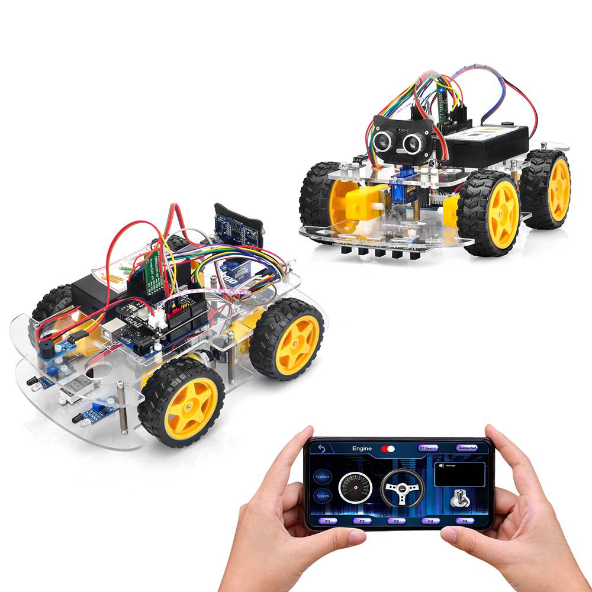
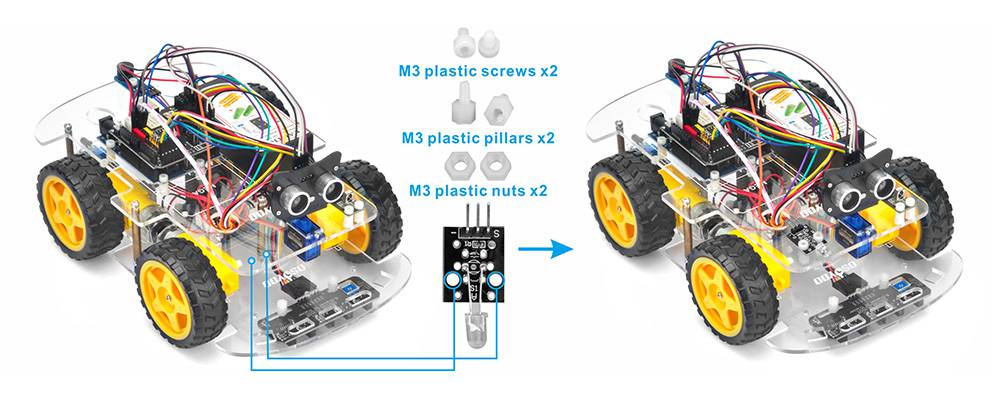
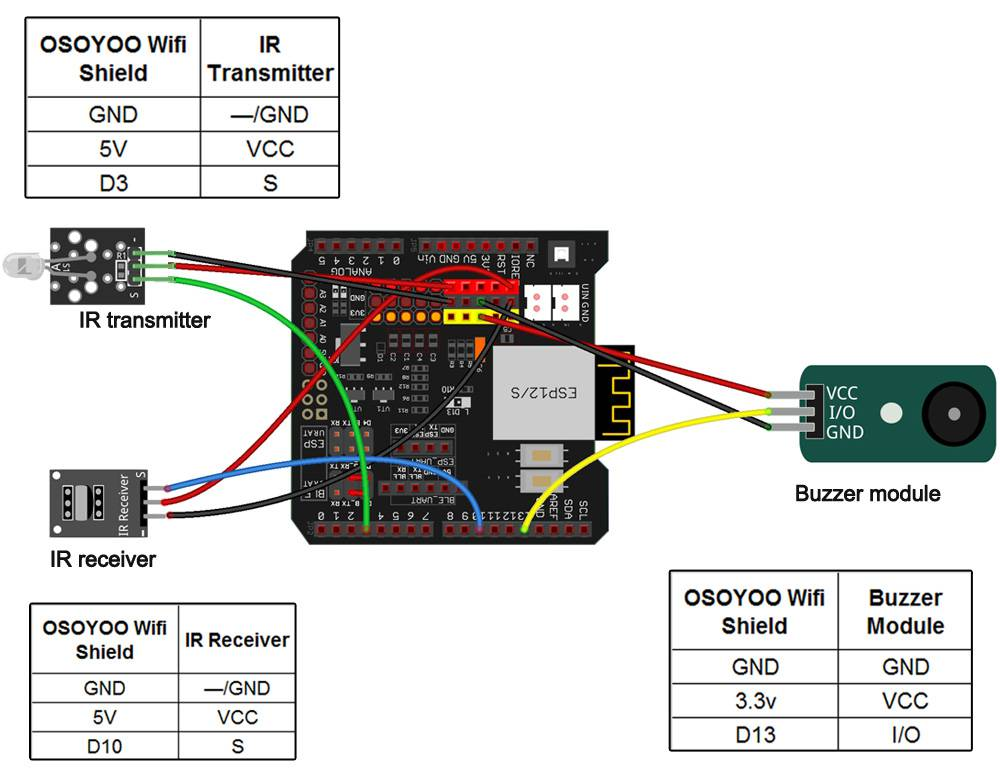
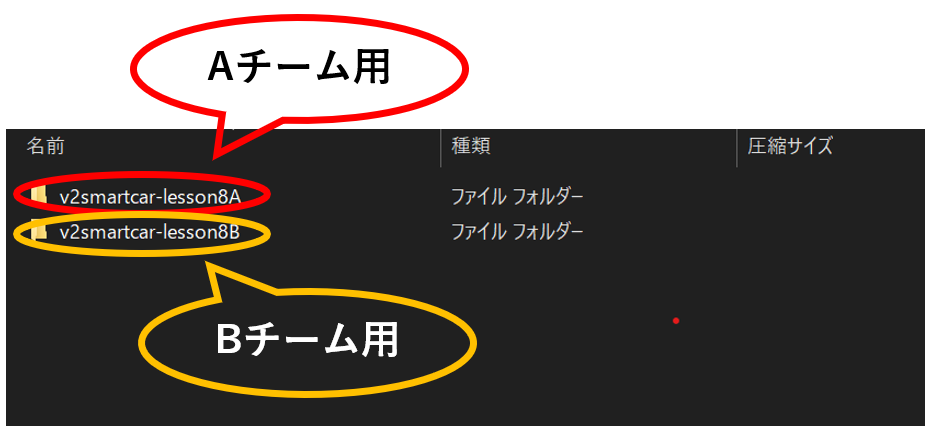
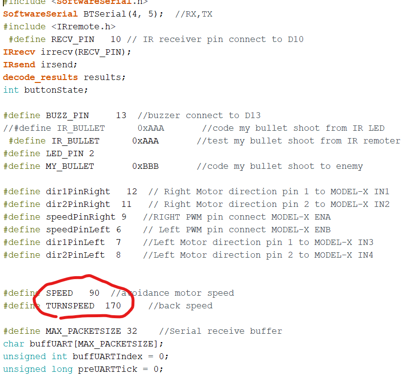

# レッスン20 ロボット対戦ゲーム1

> ⚔️ **ここから2回にわたって対戦ゲームです。** キットのパーツを使い切る、実践の総仕上げ。

## ミッション

**赤外線の弾を撃ち合うロボットを作って、友だちと対戦しよう。**

## このレッスンで身につける力

- [ ] 不要なセンサー・モーター類を取り外すことができる
- [ ] 必要なセンサー類を取り付けることができる
- [ ] チームAとチームBのちがいを理解できる
- [ ] サンプルコードを実行できる
- [ ] 対戦を有利に行うためにサンプルコードを修正できる

## 今回使う技術

- 赤外線**送信**モジュール（今までは受信だけだった）
- （復習）赤外線受信モジュール — **入門05**
- （復習）ブザー — **入門06**
- （復習）Bluetooth操縦 — **レッスン19**



> **いままで学んだことが全部つながります。**
> 赤外線で撃ち、ブザーで知らせ、Bluetoothで操縦する。入門から積み上げてきたものの集大成です。

---

## ミッションの準備

### 用意するもの

- [ ] レッスン11で完成させたロボット
- [ ] 赤外線受信モジュール x1
- [ ] **赤外線送信（トランスミッター）モジュール x1** ←今回はじめて使う
- [ ] ブザーモジュール x1
- [ ] M3プラスチックネジ・ピラー・ナット x2
- [ ] F/Mジャンパー線
- [ ] HCモジュール（Bluetooth）
- [ ] タブレット
- [ ] USBケーブル、パソコン

### 手順

このプロジェクトには、**少なくとも2台のロボット**が必要です。友だちとチームを組もう。

- [ ] 「（日付4桁）(自分の名前・ローマ字)20」で保存する
- [ ] スケッチのフォルダに **`motor_driver.h` をコピー**する

---

## メインミッション

### ステップ1 対戦のルールを知ろう

ロボットの戦闘ゲームを作ります。

- ロボットのグループが**2つ**必要です（チームAとチームB）
- チームAのロボットは、チームBのロボットを撃つための**弾丸として赤外線信号を発信**します。その逆も同じ
- **チームAの赤外線弾丸は、チームBのロボットのみを「倒し」、チームAに害を及ぼしません**
- プレイヤーは**レッスン19のアプリ**でロボットを操縦し、敵チームのロボットをできるだけ倒します

> **なぜAとBで分けるの？**
> 同じ信号だと、自分の撃った弾で自分が倒れてしまいます。
> だから、チームごとに**違う信号（IRコード）**を使い、「自分の弾は効かない」ようにしてあります。
>
> ```
> チームA が撃つ弾  = 0xBBB  → チームBだけに効く
> チームB が撃つ弾  = 0xAAA  → チームAだけに効く
> ```
>
> 「Aチームだから 0xAAA を撃つ」ではないので注意。
> **自分が撃つ弾は `MY_BULLET`、自分が倒れる弾は `IR_BULLET`** で決まります。
>
> **入門05**でリモコンのボタンごとにコードが違ったのと同じ仕組みです。

### ステップ2 不要なセンサーを取り外そう

今回は**赤外線受信器・赤外線送信器・ブザーモジュール**を使います。それ以外のセンサやモジュールをはずそう。

- [ ] 不要なセンサー・モーター類を取り外せたらチェック

### ステップ3 必要なセンサー類を取り付けよう

IRレシーバーとブザーモジュールを取り付け、次のように2個のM3プラスチックネジ、ピラー、ナットを使用して**IRトランスミッター**を追加します。



IRレシーバー、IRトランスミッター、ブザーモジュールをOSOYOO UartWiFiシールドに接続します。



> ### ⚠ 右モーターのPWM（ENA）を **D9** につなぎかえます
>
> **レッスン14と同じ理由**です。赤外線のライブラリはArduinoの**タイマー2**を使い、
> D3の速さの調節（`analogWrite`）も同じタイマー2を使うため、両方はいっしょに使えません。
>
> さらに今回は**赤外線で弾を撃つ**ので、送信モジュールは **D3** につなぎます。
> （送信に使うピンはIRremoteライブラリが決めていて、変えられません）
>
> プログラムの1行目の `#define USE_IR_ROBOT` が、その切りかえをしています。
>
> | 部品 | ピン |
> |---|---|
> | IRトランスミッター（送信） | D3 |
> | IRレシーバー（受信） | D10 |
> | ブザー | D13 |
> | **右モーターPWM（ENA）** | **D9** |

> **受信と送信のちがい**
> - **受信（レシーバー）** … 赤外線を**受け取る**。入門05から使ってきたもの
> - **送信（トランスミッター）** … 赤外線を**出す**。リモコンの中に入っているのと同じ部品
>
> 今回、ロボットは**リモコンにもテレビにもなる**わけですね。

- [ ] 必要なセンサー類を取り付けられたらチェック

### ステップ4 チームを決めて、正しいコードを書き込もう

> ### ⚠ AチームとBチームで、書き込むプログラムがちがいます
>
> サンプルコードは `sample/` フォルダにあります。
> **自分がどちらのチームか確認してから**書き込もう。

| 自分のチーム | 使うファイル |
|---|---|
| **チームA** | `sample/lesson_20_sampleA/lesson_20_sampleA.ino` |
| **チームB** | `sample/lesson_20_sampleB/lesson_20_sampleB.ino` |

どちらのフォルダにも `motor_driver.h` が入っています。**.ino といっしょにスケッチのフォルダへコピー**しよう。

コードの上のほうに、こんな行があります。

```C++
// #define IR_BULLET      0xAAA       //Aの時はこちらを使う。Bの時はコメントアウト
// #define MY_BULLET      0xBBB       //Aの時はこちらを使う。Bの時はコメントアウト
#define IR_BULLET      0xBBB       //Bの時はこちらを使う。Aの時はコメントアウト
#define MY_BULLET      0xAAA       //Bの時はこちらを使う。Aの時はコメントアウト
```

`//` がついている行は**コメント**です（**入門02**で習ったね）。
使いたいほうの `//` を外し、使わないほうに `//` をつけます。

- **`MY_BULLET`** … 自分が撃つ弾の信号
- **`IR_BULLET`** … 自分が当たると倒れる弾の信号

この2つが**逆になっていると、自分の弾で自分が倒れます。** 必ず確認しよう。

### ステップ5 アプリで操縦しよう

1. **レッスン19**でアプリを入れた人はそのまま使えます
2. HC-02 Bluetoothモジュールをタブレットにペアリング
3. アプリを開いて HC-02 をクリックして接続

   

4. 「**エンジン切り替え**」アイコンをクリックすると、ロボットカーが動き始めます
5. ハンドルとギアを使って方向を変えます
6. 敵を見つけたら「**F1**」をクリックして弾を撃ちます

**弾が敵の車に当たると、敵の車はフリーズし、ブザーを鳴らして止まり、アプリが「デッド」と表示します。**



- [ ] サンプルコードを実行できたらチェック

---

## 確認

### 撃てるか・当たるかを確かめよう

**いきなり対戦しないこと。** 2人1組で、1つずつ確かめます。

#### ① 自分の弾が出ているか

- [ ] F1を押すと、ブザーが鳴る（撃った合図）

#### ② 相手の弾を受け取れるか

相手に撃ってもらいます。

- [ ] 当たるとブザーが鳴って止まる
- [ ] アプリに「デッド」が出る

#### ③ 自分の弾で自分が倒れないか ⭐

**ここが一番大事です。**

- [ ] 壁に向かって近くで撃っても、自分は倒れない

自分の弾で自分が倒れる場合は、`MY_BULLET` と `IR_BULLET` が**逆**になっています。

#### ④ 味方を撃っても倒れないか

同じチームの人に撃ってみよう。

- [ ] 同じチームの人は倒れない
- [ ] 違うチームの人は倒れる

うまくいかないときは、ここを見てみよう。

| 症状 | 見るところ |
|---|---|
| 撃っても何も起きない | IRトランスミッターの配線 |
| 当たっても倒れない | IRレシーバーの配線／`IR_BULLET` の値 |
| 自分の弾で自分が倒れる | `MY_BULLET` と `IR_BULLET` が逆 |
| 味方も倒れる | 両方とも同じチームのコードを書き込んでいないか |
| 遠くから当たらない | 赤外線はまっすぐしかとどかない。正面から撃つ |
| 操縦できない | レッスン19の確認に戻る |

> **赤外線はまっすぐしか飛びません（入門05）。** 横や後ろからは当たりません。
> これは**戦略**に使えます。相手の背後を取れば、撃たれずに撃てます。

---

## やってみよう

### 1. 対戦しやすい速度に調整しよう

サンプルコードの上部を見てみると、機体の速度が調整できるよ！



| 速さ | よいところ | 悪いところ |
|---|---|---|
| おそい | ねらいやすい | 逃げられない |
| 速い | 逃げやすい・近づきやすい | ねらいが定まらない |

**自分の戦い方に合わせて**調整しよう。

- [ ] 対戦しやすい速度に調整できたらチェック

### 2. 自分の戦い方を決めよう

| タイプ | 作戦 | 向いている設定 |
|---|---|---|
| **攻撃型** | 正面から突っこんで撃つ | 速さ重視 |
| **回りこみ型** | 相手の背後にまわる | 曲がりやすさ重視 |
| **待ちぶせ型** | 動かずに、来たら撃つ | ねらいやすさ重視 |

- [ ] 自分の戦い方を決められたらチェック
- [ ] その戦い方に合う設定にできたらチェック

### 3. 3回対戦して記録しよう

| 回 | 相手 | 結果 | うまくいったこと | 直したいこと |
|---|---|---|---|---|
| 1 | | 勝ち / 負け | | |
| 2 | | 勝ち / 負け | | |
| 3 | | 勝ち / 負け | | |

**負けた理由を考えることが、次のレッスンにつながります。**

- [ ] 3回対戦して記録できたらチェック
- [ ] 負けた原因を1つ以上挙げられたらチェック

### 4. 次回にそなえて考えておこう

次のレッスン21では、**自分だけの必殺技**をプログラムします。
どんな技があったら勝てるか、いまのうちに考えておこう。

- [ ] ほしい必殺技のアイデアを3つ書けたらチェック

---

## まとめ

- 赤外線**送信**モジュールを使うと、ロボットがリモコンのように信号を出せる
- チームごとに**違う信号**を使うから、自分の弾では倒れない
- `MY_BULLET`（撃つ弾）と `IR_BULLET`（当たる弾）を**逆にしてはいけない**
- コメント `//` を使って、AとBを切りかえる
- 赤外線は**まっすぐしかとどかない**。これは戦略に使える
- 速さと、ねらいやすさはトレードオフ。**自分の戦い方に合わせて選ぶ**
- 対戦前に、①撃てる ②当たる ③自分は倒れない ④味方は倒れない を確かめる

### できるようになったことをチェックしよう

- [ ] 不要なセンサー・モーター類を取り外すことができる
- [ ] 必要なセンサー類を取り付けることができる
- [ ] チームAとチームBのちがいを理解できる
- [ ] サンプルコードを実行できる
- [ ] 対戦を有利に行うためにサンプルコードを修正できる

### まとめページに書こう

Googleサイトの自分の**まとめページ**に、次の4つを書こう。

1. **やったこと**
2. **わかったこと**
3. **感じたこと**
4. **つぎやること**

**スクリーンショットか画像を必ず1枚入れること。** 今日は対戦しているところの写真か動画を入れよう。

> まとめは1日に1回書く。
> 複数のレッスンを進めた日も、1つのレッスンが1回で終わらなかった日も、まとめは1回。
