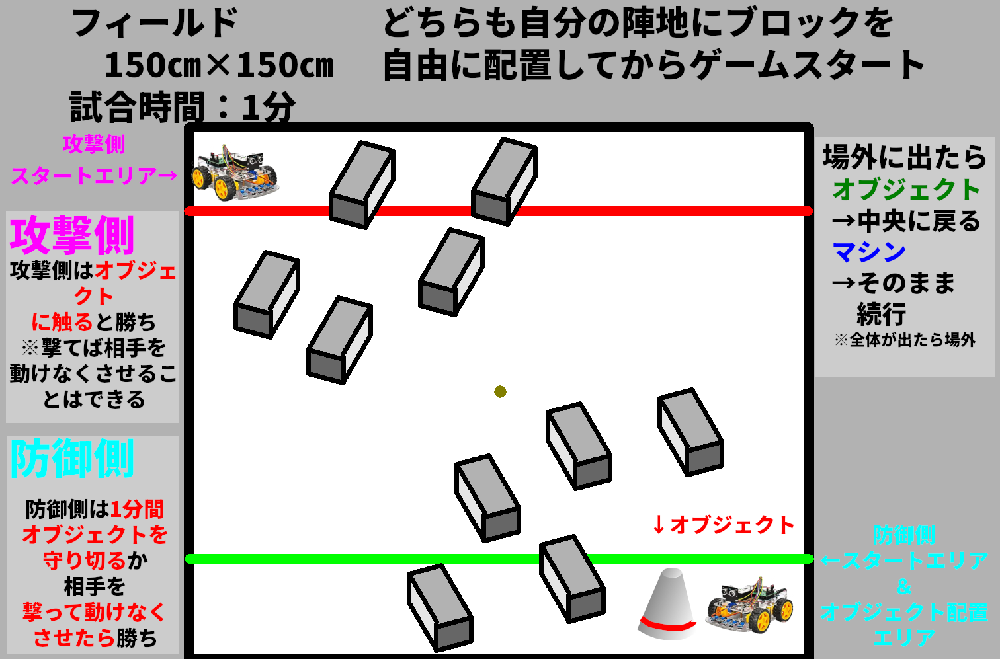
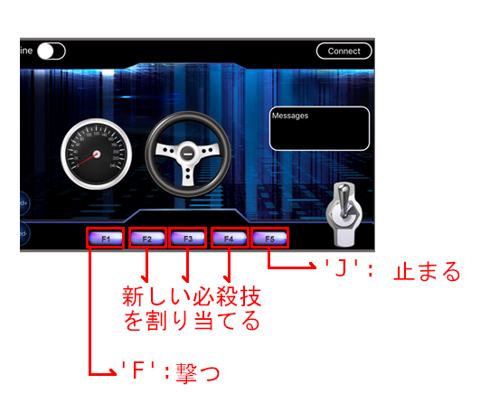

# レッスン21 ロボット対戦ゲーム2 必殺技

> ⭐ **このレッスンは実践の「到達課題」です。** ここまでできたらキットは完成。次は自分だけのロボットを作る「応用」に進みます。

## ミッション

**自分だけの必殺技を考えてプログラムし、対戦で使って改良しよう。**

## このレッスンで身につける力

- [ ] 対戦のルールを把握して、自分なりの戦略を考えることができる
- [ ] 戦略に基づいて必殺技の構想を考えることができる
- [ ] 構想に基づいて必殺技をプログラムで実現できる
- [ ] 作った必殺技を対戦で試して修正することができる

## 今回使う技術

- （復習）`switch` / `case` — **入門09**
- **自分で関数を作る** `void 関数名(){}`
- 動きのシーケンス（順番）の設計

> **これまでは「用意された関数を使う」でした。今回は「自分で関数を作る」です。**
> 自分で作った動きに、自分で名前をつけます。

---

## ミッションの準備

### 用意するもの

- [ ] レッスン20で作った対戦仕様のロボット
- [ ] タブレット
- [ ] USBケーブル x1
- [ ] パソコン x1
- [ ] 対戦用のフィールド

### 手順

- [ ] レッスン20のスケッチを開き、「（日付4桁）(自分の名前・ローマ字)21」で**名前を付けて保存**する

> **名前を変えて保存するのを忘れずに。** 失敗したときにレッスン20の状態に戻れます。

> できあがりの例は `sample/lesson_21_sample/lesson_21_sample.ino` にあります。
> **まずは自分で書いてみて**、どうしても動かないときに見よう。

---

## メインミッション

### ステップ1 対戦のルールを把握しよう



**対戦を有利にするために考えること**

- 防御側がどこにオブジェクトを置くか
- 攻撃側は相手から撃たれないように、ブロックをどう配置するか
- オブジェクトが外に出たとき、中央に戻ることが有利になるように考える
- 防御側は撃たれただけでは負けにならないので、オブジェクトに触るのを邪魔するようにやられるべき

**※AチームとBチームのプログラムでないと対戦はできません。**

### ステップ2 ボタンの割り当てを知ろう

まずコードの `switch` 文のところを見よう。
ここは、**タブレットのアプリから飛んできたメッセージに、どんな動きを割り当てるか**が書かれています。

```C++
  switch (Uart_Date)    //serial control instructions
  {
    case 'M': go_Advance(SPEED, 0); break;
    case 'L': go_Left(TURNSPEED, 0); break;
    case 'R': go_Right(TURNSPEED, 0); break;
    case 'B': go_Back(SPEED, 0); break;
    case 'X': back_Left(TURNSPEED, 0); break;
    case 'Y': back_Right(TURNSPEED, 0); break;
    case 'F': shoot();break;
    case 'E': stop_Stop() ;buzz_Off();break;
    case 'J': stop_Stop() ;break;
    default:break;
  }
```

> **`switch` 文は入門09（サーボモーター）で習ったね。**
> あのときはリモコンのボタンでサーボの角度を変えました。今回はアプリのボタンでロボットの動きを変えます。**同じ仕組みです。**

はじめのうちは、このようなボタンの割り当てになっています。



| 値 | ボタン | 初めの割り当て | 効果 |
| --- | --- | --- | --- |
| F | F1 | `shoot();` | 赤外線で撃つ |
| **G** | **F2** | **なし** | **なし** |
| **H** | **F3** | **なし** | **なし** |
| **I** | **F4** | **なし** | **なし** |
| J | F5 | `stop_Stop();` | エンジンをかけたまま止まる |

**F2・F3・F4 が空いています。** ここに必殺技を入れます。

### ステップ3 まずF2で音を鳴らしてみよう

いきなり必殺技を作らず、**まず1行足すだけ**から始めます。

`'G'` に音を鳴らす `beep()` を割り当ててみましょう。
`beep(回数, 長さ)` は `motor_driver.h` に入っている関数です（**レッスン11**の一覧で見たね）。

```C++
  switch (Uart_Date)    //serial control instructions
  {
    case 'M': go_Advance(SPEED, 0); break;
    case 'L': go_Left(TURNSPEED, 0); break;
    case 'R': go_Right(TURNSPEED, 0); break;
    case 'B': go_Back(SPEED, 0); break;
    case 'X': back_Left(TURNSPEED, 0); break;
    case 'Y': back_Right(TURNSPEED, 0); break;
    case 'F': shoot();break;
    case 'G': beep(3, 100);break; // この行を追加する
    case 'E': stop_Stop() ;buzz_Off();break;
    case 'J': stop_Stop() ;break;
    default:break;
  }
```

タブレットのF2ボタンを押して音が鳴ったら成功です。
できた人は、続けてF3、F4ボタンにも `beep()` を追加してみましょう。回数や長さを変えると、音で区別できます。

- [ ] F2に音を追加できた
- [ ] F3に音を追加できた
- [ ] F4に音を追加できた

> **`break;` を忘れないこと。** 忘れると次の `case` も実行されてしまいます（入門09の復習）。

### ステップ4 必殺技の関数を作ろう

まず、必殺技の動きの**関数**を作ります。
関数とは、いくつかの処理をまとめて名前を付けたものですね（**レッスン11**で習いました）。

#### 関数の作り方

```C++
void 関数名(){
  （処理）
}
```

では試しに、**1秒進んで止まる**という動きをする `hissatsu` という名前の関数を作ってみましょう。

プログラムの**一番最後のところ**に、次のようなコードを追加します。

```C++
void hissatsu(){
  go_Advance(SPEED, 0); // 前に進む
  delay(1000); // 1秒=1000ミリ秒待つ
  stop_Stop(); // 止まる
}
```

#### ボタンに必殺技を割り当てる

次に、これをF2のボタンに割り当ててみましょう。

```C++
    case 'G': hissatsu();break; // この行を書き換える
```

F2ボタンを押して1秒前に進む、という動きができましたか？ できたら成功です。

- [ ] 関数 `hissatsu()` を作ることができた
- [ ] F2ボタンに `hissatsu()` を割り当てることができた

### ステップ5 動いてから撃つ必殺技にしよう

移動するだけでは面白くないですね。では、**前に進んでから撃つ**というプログラムを作ってみましょう。

先ほどの `hissatsu()` を書き換えます。

```C++
void hissatsu(){
  go_Advance(SPEED, 0); // 前に進む
  delay(1000); // 1秒=1000ミリ秒待つ
  stop_Stop(); // 止まる
  shoot(); // ここを追記。赤外線で撃つ
}
```

ボタンの割り当てはすでに済んでいるので、変える必要はありません。
**動くと撃つ、2つの動きを1つのボタンでできましたか？**

- [ ] 関数 `hissatsu()` に赤外線で撃つ機能を追加できた

> **これが関数のすごいところです。**
> 何個の動きをまとめても、呼び出すのは `hissatsu();` の**1行だけ**。
> 対戦中にボタンを何回も押す必要がなくなります。

---

## 確認

### 必殺技が動くか確かめよう

**対戦する前に、1人で確かめます。**

- [ ] F2を押すと、必殺技が最後まで動く
- [ ] 動いている途中で止まらない
- [ ] 技が終わったあと、ふつうの操縦にもどれる
- [ ] 技を**続けて2回**使っても大丈夫

### 技の長さを確かめよう

- [ ] 必殺技が終わるまでの時間を測った（ ___ 秒）

> **⚠ 長い技には気をつけよう。**
> 技が動いているあいだは**操縦できません。** 3秒の技なら、3秒間まったく動かせないということ。
> そのあいだに相手に撃たれます。**強い技ほど、長くて危ない。**

うまくいかないときは、ここを見てみよう。

| 症状 | 見るところ |
|---|---|
| F2を押しても何も起きない | `case 'G':` の行があるか／`break;` があるか |
| 技の途中で止まる | `delay()` の時間が短すぎないか |
| 技のあと操縦できない | 最後に `stop_Stop();` があるか |
| 撃てない | `shoot();` を書いているか／IRトランスミッターがD3につながっているか |
| コンパイルエラー | 関数を `loop()` の**外**に書いているか |

---

## やってみよう

### 1. オリジナルの必殺技を考えよう

ここまで来たら、**オリジナルの必殺技**を作ってボタンに割り当てることができるはずです。
どんな必殺技があったら対戦で有利になるか、考えてみましょう。

過去にはこんな必殺技を考えた人がいました。

1. ぐるぐる回りながら撃つ
2. バックしながら撃つ
3. 速度を変える
4. ちょっとだけ向きを変える
5. 突進する

#### 考える順番

**いきなりコードを書かないこと。** この順番で考えると作りやすくなります。

| 手順 | 考えること | 自分の答え |
|---|---|---|
| ① | **どんな場面で困っている？** （例：背後を取られる） | |
| ② | **どうすれば解決する？** （例：後ろを向いて撃つ） | |
| ③ | **どんな動きの順番？** （例：180度回る → 撃つ） | |
| ④ | **何秒かかる？** | |

③まで書けたら、そのままプログラムになります。

```C++
void hissatsu(){
  go_Right(200, 600);   // 180度回る（レッスン13で調べた時間を使う）
  stop_Stop();
  shoot();  // 撃つ
}
```

- [ ] ①〜④を埋められたらチェック
- [ ] 必殺技をプログラムできたらチェック

### 2. 必殺技を3つ作ろう

F2・F3・F4 に、**違う役わりの技**を入れよう。

| ボタン | 技の名前 | どんな場面で使う |
|---|---|---|
| F2 | | |
| F3 | | |
| F4 | | |

> **全部「撃つ技」にしないこと。** 逃げる技、かわす技もあると戦いやすくなります。

- [ ] 3つの必殺技を作れたらチェック

### 3. ⭐ 対戦で試して改良しよう

**ここが到達課題です。** 作って終わりではありません。**使って、直します。**

| 回 | 使った技 | 結果 | うまくいった？ | どう直す？ |
|---|---|---|---|---|
| 1 | | 勝ち / 負け | | |
| 2 | | 勝ち / 負け | | |
| 3 | | 勝ち / 負け | | |

**改良したあと、もう一度対戦しよう。**

| 回 | 直したところ | 結果 | よくなった？ |
|---|---|---|---|
| 4 | | 勝ち / 負け | |
| 5 | | 勝ち / 負け | |

- [ ] 対戦で必殺技を使えたらチェック
- [ ] **使ってみて、直したいところを見つけられたらチェック** ⭐
- [ ] **実際に直して、もう一度対戦できたらチェック** ⭐

### 4. 友だちの技を見てみよう

ほかの人はどんな技を作ったかな？ 見せてもらって、いいところを取り入れよう。

- [ ] 友だちの技を見て、自分の技に取り入れられたらチェック

---

## まとめ

**switch文の書き方**（入門09の復習）

```C++
  switch (変数)
  {
    case 変数の中の値1:その時の動き; break;
    case 変数の中の値2:その時の動き; break;
    default:どの値でもない時の動き; break;
  }
```

**関数の作り方**

```C++
void 関数名(){
  （処理）
}
```

- **自分で関数を作れる**と、いくつもの動きを1つのボタンにまとめられる
- 必殺技は **①困っている場面 → ②解決の方法 → ③動きの順番 → ④かかる時間** の順に考える
- **強い技ほど長くて、そのあいだ操縦できない。** 強さと危なさはトレードオフ
- 技は作って終わりではない。**使って、直して、また使う**
- 対戦で負けた理由を考えることが、次の工夫につながる

### できるようになったことをチェックしよう

- [ ] 対戦のルールを把握して、自分なりの戦略を考えることができる
- [ ] 戦略に基づいて必殺技の構想を考えることができる
- [ ] 構想に基づいて必殺技をプログラムで実現できる
- [ ] 作った必殺技を対戦で試して修正することができる

### まとめページに書こう

Googleサイトの自分の**まとめページ**に、次の4つを書こう。

1. **やったこと**
2. **わかったこと**
3. **感じたこと**
4. **つぎやること**

**スクリーンショットか画像を必ず1枚入れること。** 今日は必殺技を使っているところの動画を入れよう。

> まとめは1日に1回書く。
> 複数のレッスンを進めた日も、1つのレッスンが1回で終わらなかった日も、まとめは1回。

---

## 🎓 実践クリア！

ここまでで**キットは完成**です。入門01から数えて21回、おつかれさまでした。

これまでにやったこと：

- ブレッドボードで回路を作り、部品の仕組みを知った（入門）
- ロボットを組み立てて、センサーを載せ、自分で判断させた（実践）
- 通信で操縦し、対戦で戦略を考えた

**次は「応用」です。** キットを離れて、**自分だけのロボットを設計して作ります。**
何を作るかは自分で決めます。いままで使ったセンサーの中から、自分の作りたいものに必要なものを選んで組み込みます。

どんなロボットを作りたいか、いまから考えておこう。

---

<details><summary>📋 指導員向け：実践の進級判定ポイント</summary><div>

このレッスンは**実践の到達課題**です。次の観点で観察してください。

| 観点 | 見るところ |
|---|---|
| 課題の目的を理解して始められる | ルールを読んで、自分から戦略を考え始めたか |
| センサーを正しく取り付け配線できる | レッスン20の取り付けを自力でできたか |
| コードを読んでどこを変えるか見当をつけられる | `switch` 文の場所を自分で見つけられたか |
| 条件分岐・繰り返し・関数を書き足せる | `void hissatsu(){}` を自分で書けたか |
| 動作テストを自分から行う | 対戦前に1人で技を試したか |
| 原因を切り分けられる | 技が動かないとき、割り当てと関数のどちらを先に見たか |
| ヒントをもとに解決できる | 答えを聞かずに、ヒントから自分で直せたか |
| なぜその方法にしたか説明できる | 「なぜこの技を作ったか」を場面から説明できるか |

**合格の目安**：**自分で考えた必殺技を対戦で使い、うまくいかなかった点を見つけて修正し、もう一度対戦できた**こと。

「動く技を1つ作った」だけでは到達とは言えません。**使って → 直して → また使う**のサイクルが1周回ったかを見てください。

**つまずきやすい点**
- `break;` の書き忘れで、複数の技が同時に動く
- 関数を `loop()` の中に書いてしまいコンパイルエラー
- 技を長くしすぎて、そのあいだに撃たれることに気づかない → 対戦させると自分で気づきます
- `MY_BULLET` / `IR_BULLET` の取りちがえ（レッスン20から持ち越し）

**応用へ進める生徒には**：`common/` のセンサー早見表と `motor_driver.h` を渡し、「自分の機体でこれを使う」と伝えてください。

</div></details>
